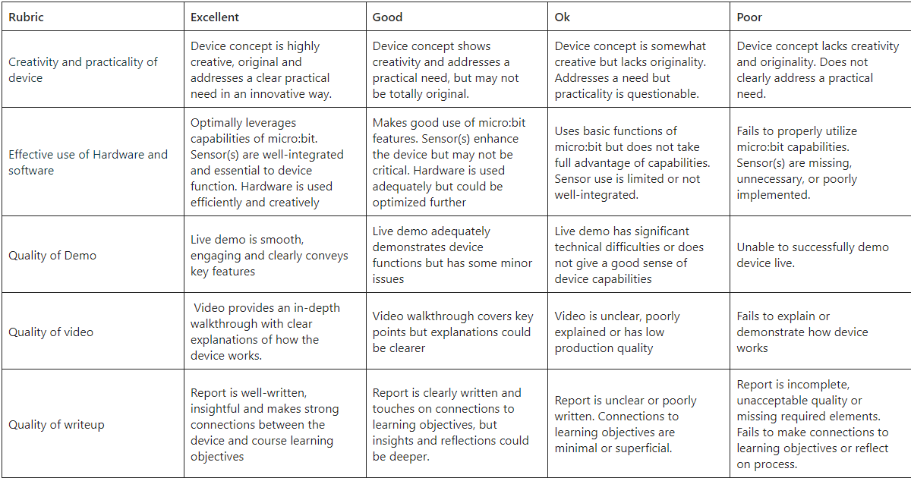
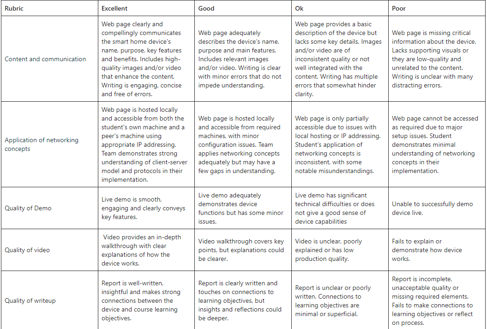

# IS114 Missions 
---

## Table Of Contents:
- [Mission 1: Design and build a smart home device prototype](#mission-1-design-and-build-a-smart-home-device-prototype)
  - [Design and build a device to serve a practical function and improve daily life.](#design-and-build-a-device-to-serve-a-practical-function-and-improve-daily-life)
- [Mission 2: Networking](#mission-2-networking)
  - [Create a web page to accompany the smart device](#create-a-web-page-to-accompany-the-smart-device)

## Mission 1: Design and build a smart home device prototype
This far, you have learnt the following:

- **Compute**: Understand the fundamentals of computation and how microcontrollers process information
- **Storage & Memory:** Learn about different types of storage and memory in computing devices
- **Hardware & Software:** Explore the interplay between physical components and code
- **Inputs & Outputs**: Discover how devices take in data from the environment and produce outputs

For this mission, you are required to:

### Design and build a device to serve a practical function and improve daily life. 

**Requirements:**

1. Use a Micro:Bit as the main controller.
2. Incorporate at least 1 sensor and one output.
3. Implement basic logic to make the device interactive/automated.
4. You can use any household materials for your project.

**Deliverables:**

1. You should show a one-minute live demo of your working project to your Prof/Instructor in class.
2. Produce a 2-minute video walkthrough with voiceover explaining how your prototype works.
3. Write a short report covering why your device is useful, how your device relates to what you learnt so far in the module and your reflections on building the prototype. (no longer than 3 pages).

**Grading rubrics:**

- Creativity and practicality of device (2) 
- Effective use of Hardware and software (2) 
- Quality of Demo (2) 
- Quality of video (2) 
- Quality of writeup (2)

## Mission 2: Networking 
This far, you have learnt the following:
- **Networking**: Understand how devices communicate over networks
- **HTTP**: Learn about the protocols for transmitting web page data
- **IP Addresses**: Differentiate between public and private IP addresses
- **Client-Server Model**: Explore how browsers and servers interact to deliver content

For this mission, you are required to:

### Create a web page to accompany the smart device.
**Requirements:**
- Build the page using plain HTML with at-least two pages that you can navigate between.
- Include device name, description, features, and images or a video.
- Host your page and access it using your own machine and your friend’s machine using an appropriate IP address.
 
**Deliverables:**
- Demonstrate the working page to the faculty in class (in one minute).
- Produce a 2 minute video walkthrough with voiceover explaining your page's features.
- Write a short report (less than 3 pages) covering the learning objectives and how they relate to your page.
 

**Grading rubrics:**
- Content and communication (2)
- Application of networking concepts (2)
- Quality of Demo (2)
- Quality of video (2)
- Quality of writeup (2) 

